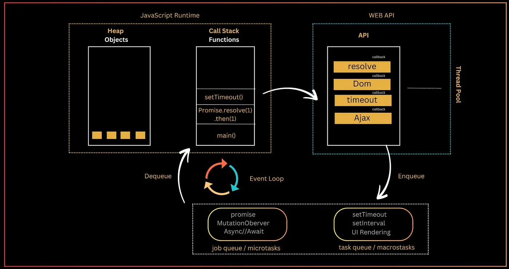

# 通过与 GPT-4 模拟面试学习 Javascript

## 👨🏻: javascript 是单线程的吗？

🤖: 是的，JavaScript 在其主要执行环境中，比如在浏览器或 Node.js 中，是单线程的。这意味着一次只能执行一个任务。但是，JavaScript 可以通过使用 Web Workers（在浏览器中）或使用其他并发处理技术（如 Node.js 的 Worker Threads）来实现多线程操作，这允许在后台线程中执行代码，而不会干扰主线程的执行。尽管如此，JavaScript 的事件循环和异步编程模型让它能有效地处理 I/O 密集型操作，尽管它在本质上是单线程的。

<hr>

## 👨🏻: 解释 JavaScript 引擎的主要组件及其工作原理。

🤖: JavaScript 引擎是一个解释和执行 JavaScript 代码的程序。它的主要组件包括但不限于以下几个：

-   解析器（Parser）：当 JavaScript 代码被加载到引擎时，解析器会读取原始代码，检查语法是否正确，并将其转换成抽象语法树（AST）。这个过程称为解析。

-   编译器：现代 JavaScript 引擎采用即时编译（JIT）策略，编译器将抽象语法树转换成机器代码而不是直接解释执行。这提高了执行效率。一些引擎可能会有多个编译器，它们在优化代码的不同方面和不同阶段工作。

-   执行栈：执行栈，也称为调用栈，是一种数据结构，用于存储在程序执行期间所有函数调用的上下文。每当一个函数被调用时，其上下文就被推送到栈中；当函数执行完成后，其上下文就会从栈中弹出。

-   堆（Heap）：堆是一个用于存储对象和其他复杂数据类型的内存区域。它是动态分配的，意味着数据可以在任何时刻被添加到堆中，且其大小不是固定的。

-   事件循环和消息队列：JavaScript 引擎利用事件循环和消息队列来处理异步事件。当异步操作（如 setTimeout、网络请求等）完成时，回调函数会被放入消息队列中。事件循环负责监视执行栈和消息队列；当执行栈为空时，事件循环会从消息队列中取出任务执行。

-   垃圾回收器：垃圾回收器自动清理不再被应用程序使用的内存。它定期检查那些不再可达的对象（即无法从根对象通过引用链访问到的对象）并释放这些对象占用的内存。

这些组件共同工作，使得 JavaScript 代码能够高效地被解析、编译、执行，并在执行过程中有效地管理内存。

<hr>

## 👨🏻: 解释 JavaScript 中的事件循环，以及它如何帮助异步编程。

🤖: JavaScript 的事件循环是其异步编程模型的核心部分，它允许 JavaScript 代码非阻塞地执行，即使 JavaScript 是单线程的。事件循环工作原理和它对异步编程的帮助可以通过以下几个要点来解释：

-   非阻塞 I/O：在 JavaScript 中，诸如网络请求、文件操作等 I/O 操作通常是异步进行的，这意味着代码的执行不会被这些操作阻塞。这是通过将这些操作的回调函数放入事件循环来实现的。

-   事件循环机制：事件循环是一个不断运行的循环，它监视调用栈和消息队列。如果调用栈为空（即当前没有正在执行的代码），事件循环就会检查消息队列。如果消息队列中有待处理的回调函数，事件循环会将它们逐一取出并推入调用栈以执行。

-   消息队列：异步事件（如定时器、用户交互、网络请求回调等）完成时，它们的回调函数会被添加到消息队列中。这些回调函数等待当前执行栈中的所有同步代码执行完成后再被执行。

-   宏任务与微任务：JavaScript 的事件循环区分了宏任务（macro tasks）和微任务（micro tasks）。宏任务包括脚本执行、setTimeout、setInterval 等；微任务包括 Promise 回调、MutationObserver 回调等。在每个宏任务执行完毕后，引擎会处理所有队列中的微任务，然后才会开始下一个宏任务，这确保了微任务优先级高于宏任务。

-   优势：这个模型的优势在于它允许单线程的 JavaScript 引擎执行长时间运行的操作而不会阻塞主线程。这是通过将耗时任务分解成小块，并将它们作为事件放入队列中，由事件循环逐一处理，从而让主线程空闲时即刻处理用户交互、动画等操作。

事件循环使得 JavaScript 能够处理复杂的异步操作，同时仍然保持代码的简洁和易于理解，这对于开发高性能的 Web 和服务器应用程序至关重要。

 </img>

<hr>

## 👨🏻: 请描述 var、let、const 之间的区别。

🤖: var, let, 和 const 是 JavaScript 中用于声明变量的关键字，它们之间有几个关键的区别：

-   作用域（Scope）：

    var 声明的变量有函数作用域，意味着在函数内声明的变量仅在该函数内部可见。
    let 和 const 声明的变量具有块级作用域（block scope），即它们仅在包含它们的块（如 if 语句、循环等）内部可见。

-   提升（Hoisting）：

    var 声明的变量会被提升到其作用域的顶部，但是初始化的值不会提升。这意味着在声明之前就可以访问这些变量，但是访问的值会是 undefined。
    let 和 const 也存在提升，但它们被提升到了块的顶部，并且在声明之前访问这些变量会导致一个引用错误（temporal dead zone）。这意味着它们实际上在声明之前是不可访问的。

-   重复声明：

    使用 var 关键字，同一作用域内可以多次声明同一个变量。
    let 和 const 不允许在相同作用域内重复声明同一个变量。

-   赋值：

    var 和 let 声明的变量可以被重新赋值。
    const 声明的变量必须在声明时初始化，且之后不能再被重新赋值。但是，如果 const 变量是一个对象或数组，其内容（对象的属性或数组的元素）可以被修改。

综上所述，let 和 const 是在 ES6 中引入的，以解决 var 存在的作用域等问题，并提供更严格的变量声明方式。在现代 JavaScript 编程中，推荐使用 let 和 const 来声明变量，因为它们提供了更清晰的作用域管理和更好的代码可维护性。

<hr>

## 👨🏻: 请介绍 js 的数据类型。

🤖: JavaScript 中的数据类型可以分为两大类：原始数据类型（Primitive data types）和对象类型（Object types）。

### 原始数据类型

原始数据类型直接存储值，它们包括：

-   Number：用于表示整数或浮点数，比如 42 或 3.14。JavaScript 不区分整数和浮点数，所有的数字都用相同的类型表示，并且还包括 NaN（不是一个数字）和 Infinity（无穷大）。

-   String：用于表示文本数据，比如 "Hello, world!"。字符串是不可变的，意味着一旦创建，它们的内容就不能改变。

-   Boolean：用于表示逻辑值 true 或 false。

-   Undefined：当一个变量被声明了但没有被赋值时，它的值是 undefined。

-   Null：用来表示一个故意的空值。与 undefined 类似，但在编码习惯上用于不同的场景。

-   Symbol（ES6 引入）：用于创建唯一的标识符。符号是不可变的且唯一的。

-   BigInt（近期引入）：用于表示非常大的整数，普通的 Number 类型无法精确表示的整数值。

### 对象类型

对象类型（或引用类型）用于存储键值对的集合或更复杂的数据结构。JavaScript 中的对象可以看作是键和值之间的映射，键是字符串（或 Symbol），值可以是任意数据类型。对象类型包括：

-   Object：标准的对象类型，可以用于存储键值对集合。

-   Array：用于存储有序的值集合。数组是特殊类型的对象，用整数作为键名。

-   Function：函数实际上是对象的一种特殊类型，可以被调用。

-   Date、RegExp 等：这些都是内置构造函数，用于创建和处理日期和正则表达式等。

对象与原始数据类型的主要区别在于，对象是通过引用来操作的，当你将一个对象赋值给一个变量时，实际上赋值的是对该对象的引用。这意味着如果你有两个变量指向同一个对象，通过其中一个变量修改对象的属性，另一个变量也会反映这种变化。

了解 JavaScript 的数据类型对于理解语言的行为和性能优化都是很重要的。

<hr>
## 👨🏻: 请介绍 js 的数据类型

🤖: JavaScript 中的数据类型可以分为两大类：原始数据类型（Primitive data types）和对象类型（Object types）。

### 原始数据类型

原始数据类型直接存储值，它们包括：

-   Number：用于表示整数或浮点数，比如 42 或 3.14。JavaScript 不区分整数和浮点数，所有的数字都用相同的类型表示，并且还包括 NaN（不是一个数字）和 Infinity（无穷大）。

-   String：用于表示文本数据，比如 "Hello, world!"。字符串是不可变的，意味着一旦创建，它们的内容就不能改变。

-   Boolean：用于表示逻辑值 true 或 false。

-   Undefined：当一个变量被声明了但没有被赋值时，它的值是 undefined。

-   Null：用来表示一个故意的空值。与 undefined 类似，但在编码习惯上用于不同的场景。

-   Symbol（ES6 引入）：用于创建唯一的标识符。符号是不可变的且唯一的。

-   BigInt：用于表示非常大的整数，普通的 Number 类型无法精确表示的整数值。

### 对象类型

对象类型（或引用类型）用于存储键值对的集合或更复杂的数据结构。JavaScript 中的对象可以看作是键和值之间的映射，键是字符串（或 Symbol），值可以是任意数据类型。对象类型包括：

-   Object：标准的对象类型，可以用于存储键值对集合。

-   Array：用于存储有序的值集合。数组是特殊类型的对象，用整数作为键名。

-   Function：函数实际上是对象的一种特殊类型，可以被调用。

-   Date、RegExp 等：这些都是内置构造函数，用于创建和处理日期和正则表达式等。

对象与原始数据类型的主要区别在于，对象是通过引用来操作的，当你将一个对象赋值给一个变量时，实际上赋值的是对该对象的引用。这意味着如果你有两个变量指向同一个对象，通过其中一个变量修改对象的属性，另一个变量也会反映这种变化。

了解 JavaScript 的数据类型对于理解语言的行为和性能优化都是很重要的。

<hr>

## 👨🏻: 什么是回调函数和回调地狱？

🤖: 在 JavaScript 中，回调函数是传递给另一个函数作为参数的函数，这个机制允许函数在执行某些操作后调用另一个函数。这是异步编程的一种常见模式，特别是在处理诸如文件读写、网络请求等耗时操作时。

### 回调函数

回调函数的一个典型应用是在事件监听器中。例如，当用户点击按钮时执行某些操作：

```javascript
button.addEventListener("click", function () {
	console.log("Button was clicked!");
});
```

在这个例子中，传递给 addEventListener 的匿名函数就是一个回调函数，它在点击事件发生时被调用。

### 回调地狱（Callback Hell）

回调地狱，也被称为“回调金字塔”，是指多个嵌套的回调函数连续使用，导致代码难以理解和维护的情况。这通常发生在处理多个异步操作时，每个操作的完成都依赖于前一个操作的结果。例如：

```javascript
fs.readFile("file1.txt", "utf8", function (err, data) {
	if (err) {
		console.error(err);
	} else {
		fs.readFile("file2.txt", "utf8", function (err, data) {
			if (err) {
				console.error(err);
			} else {
				fs.readFile("file3.txt", "utf8", function (err, data) {
					if (err) {
						console.error(err);
					} else {
						// ...
					}
				});
			}
		});
	}
});
```

随着嵌套层次的增加，代码的可读性和可维护性会大幅下降，这就是所谓的“回调地狱”。

### 解决方案

为了解决回调地狱的问题，现代 JavaScript 引入了 Promises 和 async/await 语法。这些特性允许以更直观和同步的方式写异步代码，从而避免深层嵌套的回调函数。

Promises 提供了一个更好的异步操作处理机制，允许链式调用.then()和.catch()方法来处理成功和失败的情况。
async/await 是建立在 Promises 之上的语法糖，允许在异步函数前使用 await 关键字等待 Promise 的解决，使得异步代码看起来和同步代码更相似。

```javascript
const readFile = (file) => {
	return new Promise((resolve, reject) => {
		fs.readFile(file, "utf8", (err, data) => {
			if (err) {
				reject(err);
			} else {
				resolve(data);
			}
		});
	});
};

readFile("file1.txt")
	.then((data1) => {
		return readFile("file2.txt");
	})
	.then((data2) => {
		return readFile("file3.txt");
	})
	.then((data3) => {
		// Continue with more promise-based code...
	})
	.catch((err) => {
		console.error(err);
	});
```

通过使用这些特性，可以显著提高代码的可读性和可维护性。

<hr>
